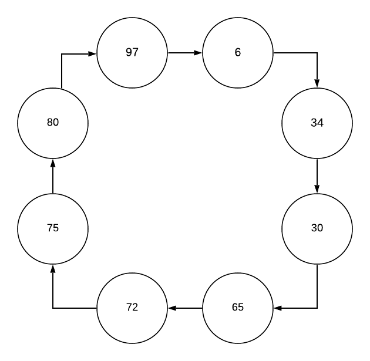

## HS-Algorithm
Academic Project for Distributed Computing (CS 6380) course at UT Dallas.

This is a program made using Java to simulate the Hirschberg–Sinclair algorithm. It uses in-built termination detection to elect a leader among nodes connected in a ring topology. It is a synchronous distributed algorithm using multi threading. The system has a master thread and n other threads, one for each node. The master thread informs the remaining threads when to start. The slave nodes then simulate the alogrithm to find the leader node.

The program uses a separate input file named "input.txt" from where it reads the user data. The first line of the file is the number of nodes in the ring followed by the unique ids of the nodes. In order to make changes to the input, the input file has to be modified only. Once that is done, the java file can be compiled and run to execute the program. 
 

 
Taking the above example as an input, where each of the 8 nodes have unique IDs, the output of the algorithm is given as follows:  

 
where the identified output matches the expected output which is 97, the node with the highest ID.
